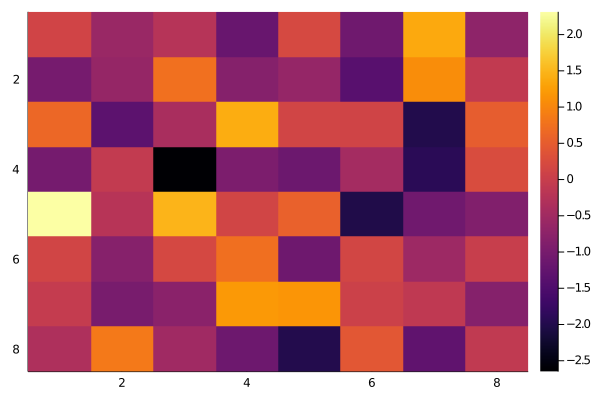
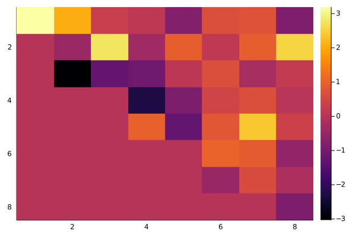
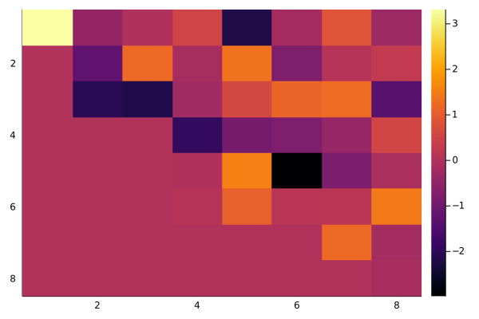
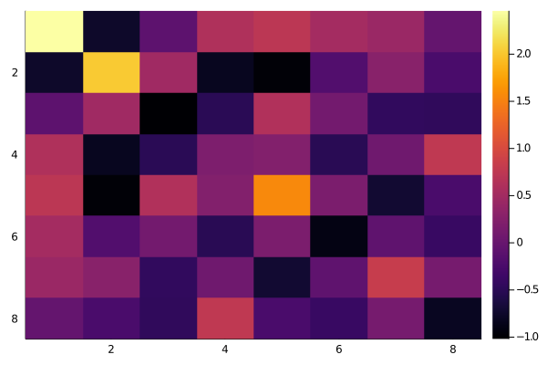
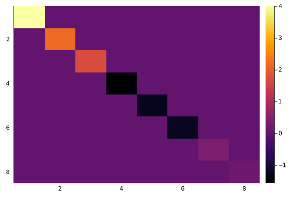
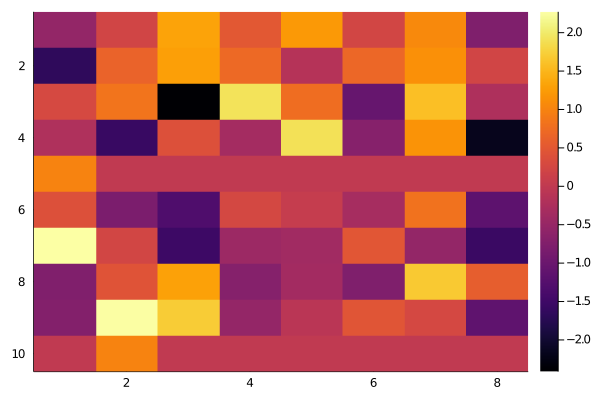

# Algoritmo QR, ou, Iteração QR


Este algoritmo foi criado para o trabalho final da disciplina de algebra linear computacional que participei no mestrado (PPGI/UFRJ). Deixei neste repositório o código dos meus testes.

:fire: Você consegue ler o relatório do trabalho final explicando os conceitos e funcionamento do algoritmo que que utiliza a decomposição QR de matrizes dando um click [aqui](https://github.com/Leomhl/qr_algorithm_iteration/blob/master/relatorio.pdf)

:fire: Para acessar o arquivo Julia com o algoritmo, [click aqui](https://github.com/Leomhl/qr_algorithm_iteration/blob/master/qr_algorithm.jl)

:fire: Para acessar o Jupyter Notebook com os testes na íntegra, [click aqui](https://github.com/Leomhl/qr_algorithm_iteration/blob/master/JupyterNotebook_testes_julia_qr_algorithm.ipynb)

```julia
# Executar na linha de comando antes de executar esse notebook
# import Pkg; Pkg.add("Colors"); Pkg.add("Plots");

using Colors, Plots

A = randn(8,8)
```


    8×8 Array{Float64,2}:
      0.122627  -0.592004   -0.229442  …  -1.10645     1.36575   -0.730861
     -1.02551   -0.639977    0.749046     -1.38966     1.07663   -0.0815654
      0.63828   -1.34971    -0.396381      0.106893   -2.01309    0.503073
     -1.03773   -0.0733535  -2.65002      -0.462227   -1.92013    0.248056
      2.31436   -0.225019    1.48083      -2.03858    -1.09901   -0.892077
      0.129565  -0.831272    0.187543  …   0.1461     -0.543062  -0.00188012
     -0.047334  -1.00469    -0.783233      0.0608912  -0.110557  -0.836096
     -0.335364   0.84836    -0.513213      0.425137   -1.29839   -0.0927203


```julia
# Plotando a matriz A, podemos observar como ela se comporta
heatmap(A, yflip=true)


```





```julia
using LinearAlgebra

# Algoritmo qr 
for k = 1:1000
    Q, R = qr(A)
    A = R*Q
end


show(stdout, "text/plain", A)
```

    8×8 Array{Float64,2}:
      3.19334    2.06069    0.292182   0.125705  -0.812038   0.656199   0.716764  -0.878712
     -5.0e-323  -0.443276   2.76637   -0.356022   0.944014   0.159272   0.942741   2.5572
      1.0e-322  -3.03416   -1.24622   -1.10401    0.086506   0.653957  -0.25117    0.21043
      0.0        0.0        0.0       -2.32815   -0.885452   0.434728   0.650328   0.0137781
      0.0        0.0        0.0        0.978152  -1.27237    0.799808   2.38166    0.37161
      0.0        0.0        0.0        0.0        0.0        1.02205    0.874078  -0.585322
      0.0        0.0        0.0        0.0        0.0       -0.469392   0.59229   -0.1533
      0.0        0.0        0.0        0.0        0.0        1.0e-323  -4.0e-323  -0.885167


```julia
# Plot da matriz
heatmap(A, yflip=true)
```





```julia
# Aplica uma tolerância de erro (1e-10) tal que substitua valores menores que ela por 0

for linha = 1:size(A)[1]
    for coluna = 1:size(A)[2]
        if(abs(A[linha, coluna]) < 1e-10)
            A[linha, coluna] = 0.0
        end 
    end
end

show(stdout, "text/plain", A)
```

    8×8 Array{Float64,2}:
     3.31631  -0.48005      -0.0303911    0.513788   -2.19565   -0.192746   0.847081   -0.326452
     0.0      -1.2641        1.22425     -0.158979    1.35731   -0.782513   0.0779815   0.282958
     0.0      -2.05528      -2.18737     -0.252912    0.622286   1.14581    1.24673    -1.37119
     0.0       2.83881e-6    3.41722e-7  -1.93656    -0.91506   -0.805147  -0.427007    0.557772
     0.0      -2.16373e-9   -3.94884e-8  -0.0260495   1.53984   -2.98595   -0.829572   -0.0888707
     0.0       2.84666e-10   1.18735e-7   0.086717    1.08227    0.125694   0.152095    1.46593
     0.0       0.0           0.0          0.0         0.0        0.0        1.22991    -0.191963
     0.0       0.0           0.0          0.0         0.0        0.0        0.0        -0.128721


```julia
# Plot da matriz
heatmap(A, yflip=true)
```





```julia
# Trabalhando com Autovalores simétricos
A_simetrica = (A + A') / 2
```


    8×8 Array{Float64,2}:
      2.45991    -0.765799  -0.0959589  …   0.515811    0.431886   -0.0396397
     -0.765799    2.02837    0.478764      -0.192372    0.27073    -0.255686
     -0.0959589   0.478764  -1.0208         0.0962501  -0.458101   -0.467588
      0.613768   -0.834362  -0.514719      -0.522205    0.0546697   0.755287
      0.724684   -0.987168   0.626105       0.1654     -0.719848   -0.254364
      0.515811   -0.192372   0.0962501  …  -0.909292   -0.0799349  -0.405052
      0.431886    0.27073   -0.458101      -0.0799349   0.826384    0.115188
     -0.0396397  -0.255686  -0.467588      -0.405052    0.115188   -0.819106


```julia
# Visualizando o que mudou da A para A_Simetrica
heatmap(A_simetrica, yflip=true)
```





```julia
for k = 1:100
    Q, R = qr(A_simetrica)
    A_simetrica = R*Q
end

show(stdout, "text/plain", A_simetrica)
```

    8×8 Array{Float64,2}:
      4.01893        2.85226e-16   -4.37532e-16   -1.84809e-16    3.05071e-16  -1.9049e-16   -1.42812e-17   3.51232e-16
     -3.30807e-27    2.17471       -1.39297e-11    3.99224e-15   -1.7342e-16    8.81307e-17   9.27257e-17  -3.53313e-16
      2.33215e-38   -1.39294e-11    1.69799       -0.000520955    1.09107e-12  -1.8988e-14    3.80759e-16   4.44512e-17
     -3.34142e-42    3.92371e-15   -0.000520955   -1.55328        3.63486e-10  -5.22049e-11  -2.43659e-17   1.37941e-16
      2.77175e-50   -6.48218e-24    1.09113e-12    3.63486e-10   -1.2749       -0.000987967   1.99066e-16  -8.38934e-19
      8.25157e-52    4.61247e-26   -1.92671e-14   -5.2205e-11    -0.000987967  -1.24309      -1.49949e-16   5.99813e-17
      1.09488e-108   3.17205e-81    3.28285e-70   -1.1534e-66    -8.86443e-58   1.46907e-56   0.339568      7.76847e-17
     -1.06518e-143  -3.50016e-116  -3.78547e-105   1.30381e-101   1.01287e-92  -1.6781e-91   -2.1758e-36    0.146931


```julia
# Aplica uma tolerância de erro (1e-10) tal que substitua valores menores que ela por 0

for linha = 1:size(A_simetrica)[1]
    for coluna = 1:size(A_simetrica)[2]
        if(abs(A_simetrica[linha, coluna]) < 1e-10)
            A_simetrica[linha, coluna] = 0.0
        end 
    end
end

show(stdout, "text/plain", A_simetrica)
```

    8×8 Array{Float64,2}:
     4.01893  0.0       0.0           0.0           0.0           0.0          0.0       0.0
     0.0      2.17471   0.0           0.0           0.0           0.0          0.0       0.0
     0.0      0.0       1.69799      -0.000520955   0.0           0.0          0.0       0.0
     0.0      0.0      -0.000520955  -1.55328       3.63486e-10   0.0          0.0       0.0
     0.0      0.0       0.0           3.63486e-10  -1.2749       -0.000987967  0.0       0.0
     0.0      0.0       0.0           0.0          -0.000987967  -1.24309      0.0       0.0
     0.0      0.0       0.0           0.0           0.0           0.0          0.339568  0.0
     0.0      0.0       0.0           0.0           0.0           0.0          0.0       0.146931


```julia
heatmap(A_simetrica, yflip=true)
```





```julia
matriz_identidade = Matrix{Float64}(I, 8, 8)
A = randn(Float64, (8,8))

show(stdout, "text/plain", matriz_identidade)

# Serve apenas para melhorar a visualização
println();println()

# Insere 2 linhas da matriz identidade para tornarmos a matriz A retangular
A = [A[1:4,:]; matriz_identidade[1,:]'; A[5:8,:]; matriz_identidade[2,:]']

show(stdout, "text/plain", A)
```

    8×8 Array{Float64,2}:
     1.0  0.0  0.0  0.0  0.0  0.0  0.0  0.0
     0.0  1.0  0.0  0.0  0.0  0.0  0.0  0.0
     0.0  0.0  1.0  0.0  0.0  0.0  0.0  0.0
     0.0  0.0  0.0  1.0  0.0  0.0  0.0  0.0
     0.0  0.0  0.0  0.0  1.0  0.0  0.0  0.0
     0.0  0.0  0.0  0.0  0.0  1.0  0.0  0.0
     0.0  0.0  0.0  0.0  0.0  0.0  1.0  0.0
     0.0  0.0  0.0  0.0  0.0  0.0  0.0  1.0
    
    10×8 Array{Float64,2}:
     -0.545912   0.205821   1.32041    0.497555   1.22233     0.224542   1.05746   -0.772542
     -1.67636    0.642832   1.28013    0.707878  -0.145686    0.682277   1.12804    0.206629
      0.285118   0.834936  -2.41239    1.92469    0.762382   -1.06272    1.58489   -0.230812
     -0.21946   -1.58242    0.385426  -0.34636    1.90766    -0.692602   1.16526   -2.18466
      1.0        0.0        0.0        0.0        0.0         0.0        0.0        0.0
      0.385296  -0.82469   -1.33192    0.258182   0.0613855  -0.325805   0.80932   -1.17248
      2.27145    0.228693  -1.52617   -0.440021  -0.377487    0.46617   -0.53994   -1.56349
     -0.764895   0.43433    1.29565   -0.705844  -0.361922   -0.769854   1.68267    0.572642
     -0.730455   2.26195    1.71027   -0.535825  -0.0817852   0.453964   0.263198  -1.14434
      0.0        1.0        0.0        0.0        0.0         0.0        0.0        0.0


```julia
heatmap(A, yflip=true)
```





```julia

```
